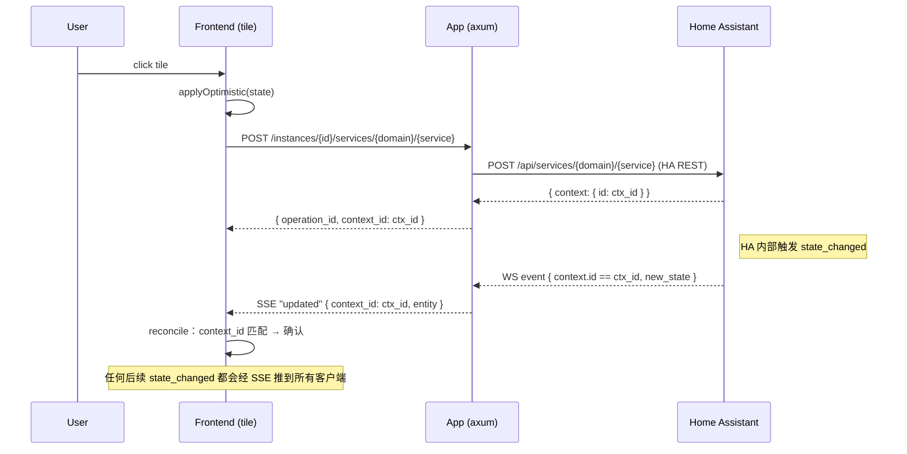

# tokimo-app-home-assistant

Tokimo 的 Home Assistant 集成 app — 多实例管理、实时双向同步、Apple Home 风格的 tile UI。

作为一个独立进程运行（axum + UDS），通过 [`tokimo-bus`][bus] 与中央 server (5678) 透明反代，
所有 `/api/apps/home-assistant/...` 请求都落到本 app。

## 功能特性

- **多 HA 实例管理**：CRUD 一组 HA 实例（`name` / `base_url` / `access_token` / `verify_tls`），
  支持「测试连接」、token 始终以 `••••<last4>` 形式返回，原始值只在数据库内保留。
- **实时双向同步**：每个实例由一个 supervisor 任务托管 HA WebSocket 长连，握手 →
  `get_states` 引导 → 订阅 `state_changed` → ping/pong 保活；断线后指数退避（1s → 30s 上限）
  自动重连。前端通过浏览器 SSE (`/data/instances/{id}/events`) 接收 `state` / `updated` /
  `removed` / `status` 事件。
- **13 类实体 tile**（`ui/src/components/tiles/`）：`light` · `switch` · `cover` · `climate` ·
  `fan` · `sensor` · `binary_sensor` · `media_player` · `lock` · `vacuum` · `scene` · `script` ·
  `camera`。每类都有专属 tile 组件 + 详情 popover。
- **房间管理**：本地 `rooms` 表既可手动建房间、也可从 HA 的 areas 一键 `sync_areas`；
  `room_entities` 自定义每个房间内的实体集合与排序；rooms 按 `instance_id` 隔离，多实例
  之间不会撞同名 area。
- **乐观 UI + ack-reconcile**：点 tile 立刻应用乐观状态，`POST services/call` 拿到的
  `context_id` 作为指纹，等 SSE `updated` 事件回来时按 `context_id` 比对：匹配 = 确认提交，
  不匹配 = 用真实状态覆盖（详见 `ui/src/state/useCallService.ts`）。
- **每实体 override**：`entity_overrides` 稀疏表存自定义名称 / 图标 / 隐藏 / 收藏标记。
- **安全**：
  - **Token mask**：`MaskedToken` 自定义 `Serialize`，确保任何响应都拿不到原文。
  - **SSRF guard**（`validate_base_url`）：DNS 解析后逐 IP 检查，拒绝 loopback
    (`127/8` · `::1`)、link-local (`169.254/16` 含云元数据 · `fe80::/10`)、未指定地址
    (`0.0.0.0` · `::`)；显式 **允许** RFC1918 / RFC4193 LAN 段（`10/8` · `172.16/12` ·
    `192.168/16` · `fc00::/7`），这是绝大多数家用 HA 部署的实际情况。仅接受
    `http` / `https` scheme。
  - **Per-instance verify_tls**：自签证书的 HA 可关掉验证，不验证时 reqwest 与
    tokio-tungstenite 共用 `tls.rs` 提供的 `NoVerify` 连接器，开关边界严格按实例隔离。

## 架构

```
Browser
  │  /api/apps/home-assistant/<route>
  ▼
tokimo-server (5678)        — 鉴权、CORS、注入 X-Tokimo-User-Id
  │  透明反代 → UDS
  ▼
$DATA_LOCAL_PATH/apps/home-assistant.sock
  │
this binary (tokimo-app-home-assistant)
  ├─ axum router (src/app_server.rs)
  │   ├─ Control plane
  │   │   ├─ GET/POST    /instances
  │   │   ├─ GET/PATCH/DELETE  /instances/{id}
  │   │   ├─ POST        /instances/{id}/test
  │   │   ├─ GET         /instances/{id}/status
  │   │   ├─ GET         /instances/{id}/entities
  │   │   ├─ GET         /instances/{id}/entities/{entity_id}
  │   │   ├─ POST        /instances/{id}/entities/{entity_id}/override
  │   │   ├─ GET         /instances/{id}/capabilities
  │   │   ├─ POST        /instances/{id}/services/{domain}/{service}
  │   │   ├─ GET         /instances/{id}/areas
  │   │   ├─ GET/POST    /instances/{id}/rooms
  │   │   ├─ POST        /instances/{id}/rooms/sync_areas
  │   │   ├─ PATCH/DELETE /rooms/{room_id}
  │   │   └─ POST/DELETE  /rooms/{room_id}/entities[/{entity_id}]
  │   ├─ Data plane (SSE)
  │   │   └─ GET         /data/instances/{id}/events
  │   └─ GET             /assets/{*path}                  (rust-embed → ui/dist)
  ├─ ConnectionPool (DashMap<Uuid, Arc<InstanceCtx>>)     启动时 load 全部实例
  │   └─ per-instance：
  │       ├─ HA WS supervisor task                        指数退避重连
  │       ├─ EntityStore (RwLock<HashMap>)                live entity state
  │       ├─ broadcast::Sender<EntityEvent>               扇出给所有 SSE client
  │       ├─ ConnStatus (RwLock)                          connecting/connected/error
  │       ├─ reqwest::Client                              honor verify_tls
  │       └─ CancelToken                                  优雅 shutdown
  ├─ tokimo-bus client                                    上报 sock，由 broker 反代
  └─ Postgres direct (schema = home_assistant)            启动跑 migrations/*.sql
```

## 数据流：从点击到状态收敛



如果回程 `context_id` 与本地 pending 不匹配（用户在别处又改了一次），real wins —
真实状态直接落库，pending 清空。

## 目录结构

```
src/
├── main.rs                     启动 / broker 注册 / 信号处理
├── app_server.rs               UDS 监听 + 路由组装
├── assets.rs                   rust-embed UI 资源（dev 可走 TOKIMO_APP_ASSETS_DIR）
├── db.rs                       PgPool + schema bootstrap + 嵌入式 migration
├── error.rs                    AppError + IntoResponse
├── tls.rs                      verify_tls=false 时的 NoVerify 连接器（reqwest/ws 共用）
├── state/mod.rs                ConnectionPool / InstanceCtx / EntityStore / supervisor
├── ha/
│   ├── mod.rs
│   ├── rest.rs                 HA REST client（test connection / call_service / states / areas）
│   └── ws.rs                   HA WebSocket：auth → get_states → subscribe → ping/pong
└── handlers/
    ├── mod.rs                  AppCtx / MaskedToken / InstanceDto
    ├── instances.rs            CRUD + test + status + SSRF guard
    ├── entities.rs             list / get / capabilities / overrides
    ├── rooms.rs                CRUD + sync_areas + entity 关联
    ├── services.rs             call_service 转发
    └── sse.rs                  SSE broadcaster

ui/
├── src/
│   ├── index.tsx               入口 + 路由
│   ├── pages/                  HomePage / RoomsPage / DevicesPage / InstancesPage / SetupPage
│   ├── components/
│   │   ├── tiles/              13 种实体 tile
│   │   ├── shell/              页面骨架
│   │   ├── DetailPopover.tsx   tile 详情弹层
│   │   └── EntityIcon.tsx      domain → lucide icon 映射
│   ├── state/                  entityStore / useEntities / useCallService
│   ├── api/                    typed client（client / instances / entities / rooms / events）
│   ├── i18n/                   多语言
│   └── types.ts                共享类型
└── dist/                       vite build 产物（rust-embed 来源）

migrations/
├── 0001_init.sql               instances / rooms / room_entities / entity_overrides
└── 0002_rooms_instance_id.sql  rooms 加 instance_id（多实例隔离）
```

## 数据库 Schema（schema = `home_assistant`）

| 表 | 字段要点 |
|---|---|
| `instances` | `id` UUID PK · `name` · `base_url` · `access_token`（明文存库，response 时 mask）· `verify_tls` BOOL · `last_connected_at` |
| `rooms` | `id` UUID PK · `instance_id` FK→instances · `name` · `icon` · `accent` · `sort_order` · `ha_area_id`（NULL = 本地房间；非 NULL = 镜像 HA area，`UNIQUE(instance_id, ha_area_id)`） |
| `room_entities` | `(room_id, entity_id)` 复合 PK · `sort_order` |
| `entity_overrides` | `entity_id` PK · `custom_name` · `custom_icon` · `hidden` · `favourite` |
| `_migrations` | 应用层 migration ledger |

## 配置 / 环境变量

| 变量 | 默认 | 用途 |
|---|---|---|
| `DATABASE_URL` | **required** | PostgreSQL 连接串（与主 server 共用一个库） |
| `DB_SCHEMA` | `home_assistant` | 本 app 私有 schema 名 |
| `TOKIMO_BUS_SOCKET` | **required** | broker 的 UDS 路径；UDS 兄弟目录 `apps/<service>.sock` 是本 app 自己的 sock |
| `TOKIMO_APP_ASSETS_DIR` | _unset_ | 仅 dev：指向 `ui/dist`，资源 handler 改走文件系统而非 embed |
| `RUST_LOG` | `info,tokimo_bus_client=info,tokimo_app_home_assistant=debug` | tracing-subscriber filter |

> 鉴权由中央 server 在反代层完成（注入 `X-Tokimo-User-Id`）。本 app 当前不做角色校验，
> `src/main.rs` 的 TODO 中已记录：admin role 强制应在 server proxy 层完成。

## 本地开发

```bash
# 1) 前端 build（rust-embed 启动时把 ui/dist 静态烘进二进制；dev 可走 watch）
cd ui && pnpm install && pnpm build
# 或：pnpm dev   # vite build --watch

# 2) 后端 build / 测试 / clippy
cargo build   -p tokimo-app-home-assistant
cargo test    -p tokimo-app-home-assistant
cargo clippy  -p tokimo-app-home-assistant --all-targets -- -D warnings
```

`scripts/dev.sh` 在主仓库会通过 `tokimo-app.toml` 的 `runtime.ui_dist` 自动注入
`TOKIMO_APP_ASSETS_DIR_HOME_ASSISTANT`，UI 改完不必 `cargo build`，浏览器强刷即可。

Rust 改动后 supervisor 不会自动检测 binary mtime，需要 `kill <pid>` 让 broker
respawn 进程。

### UI 构建配置：`@tokimo/app-builder`

`ui/vite.config.ts` 只有 `defineTokimoApp()` 一行，完整的 library 模式 + externals
（react / react-dom / @tokimo/ui / @tokimo/sdk）由共享预设
[`@tokimo/app-builder`](https://github.com/tokimo-lab/tokimo)（主仓
`packages/tokimo-app-builder/`）提供。这些 external 由主 shell 在运行时通过
`<script type="importmap">` + `window.__TKM_DEPS__` 注入同一份实例，避免重复打包
React 引发 hooks 跨边界失效。如需 app 自带的额外共享库走同样机制，传
`extraExternal: [...]`。

> 当前通过 `workspace:*` 在主 monorepo 内解析。脱离主仓独立开发的方案（git
> 依赖 / dev-only assets 注册接口）由 `@tokimo/app-builder` 后续阶段补齐。

## License

MIT OR Apache-2.0（与主 monorepo 内其它 Tokimo crate 一致）。

[bus]: https://github.com/tokimo-lab/tokimo-bus
